# 🍪 Awesome Cookie Compliance Platforms

  
  
  
  
  

## 🛡️ Top Cookie Compliance Platforms Ecosystem

**Curated Directory of SaaS Products & Open-Source GitHub Projects**
*Focused on Cookie Consent Banners, GDPR / CCPA / CPRA / ePrivacy Compliance, Google Consent Mode v2, and IAB TCF v2.3 Standards*

**Last updated: September 2026**

---

### 🌐 Overview & SEO Keywords
This repository maintains a comprehensive, community-curated list of **SaaS platforms** and **open-source consent management platforms (CMPs)** for **Cookie Compliance**. These solutions empower web application developers, privacy engineers, and legal officers to implement privacy-by-design, manage cookie consent banners, record user privacy choices, block tracking scripts dynamically, and comply with **GDPR (EU)**, **CCPA/CPRA (California)**, **ePrivacy Directive**, **LGPD (Brazil)**, **Google Consent Mode v2**, and **Global Privacy Control (GPC)**.

---

## 📋 Table of Contents

- [🏢 SaaS & Hosted Platforms](#-saas--hosted-platforms)
- [💻 Open-Source GitHub Repositories](#-open-source-github-repositories)
- [🤝 How to Contribute](#-how-to-contribute)
- [☕ Support & Sponsorship](#-support--sponsorship)
- [📈 Star History](#-star-history)
- [⚠️ Disclaimer](#️-disclaimer)

---

## 🏢 SaaS & Hosted Platforms

> 📊 **Market Size & Industry Structure**: The global Consent Management Platform (CMP) market size is estimated at **~$2.1 Billion in 2026** (projected to reach **~$4.8 Billion by 2030** at an **18.5% CAGR**). The market structure is **moderately fragmented** with enterprise consolidation centered around market leaders like OneTrust and TrustArc, alongside a prolific ecosystem of agile mid-market CMP SaaS providers.

| Platform | Company Size / Revenue / Valuation | Pricing (Starting Tier) | Free Tier / Trial Limits | Key Features & Compliance Coverage |
| :--- | :--- | :--- | :--- | :--- |
| **[OneTrust](https://www.onetrust.com/)** 🏢 | **~$4.5B Valuation** (~$300M+ ARR) | **$30 / month** ($450/year) | **14-day free trial** (up to 50,000 sessions on 1 domain) | Market leader for enterprise CMP. Includes automated cookie scanning, unified management, bulk script publishing, GPC recognition, GDPR, CCPA, and LGPD compliance. |
| **[TrustArc](https://trustarc.com/)** 🛡️ | **~$100M+ ARR** | **$249 / month** | **14-day free trial** (full access to enterprise features) | Enterprise privacy governance with unified cross-domain consent, GPC enabled by default, DSR form logging, automated website scanning, and compliance certification. |
| **[Usercentrics](https://usercentrics.com/)** 🇪🇺 | **~$50M+ ARR** | **€7 / month** | **Forever free** (up to 5,000 sessions/month for 1 domain) | European CMP leader. Features granular cookie banners, preference centers, Google Consent Mode v2 integration, IAB TCF v2.3 validation, and multi-language support. |
| **[Didomi](https://www.didomi.io/)** 🇫🇷 | **~$25M+ ARR** | **€49 / month** | **14-day free trial** (full CMP feature set enabled) | Performance-optimized CMP (co-developed INP optimizations yielding 60–70% latency reduction), server-side consent sharing, cross-device user preference sync. |
| **[Osano](https://www.osano.com/)** 🔒 | **~$50M Valuation** (~$15M+ ARR) | **$199 / month** | **Forever free** (up to 5,000 monthly visitors for 1 domain) | Simplifies compliance with automated data mapping, consent banners, and a unique **$200,000 compliance lawsuit guarantee** for misconfiguration protection. |
| **[Cookiebot](https://www.cookiebot.com/)** 🍪 | **~$20M+ ARR** *(Usercentrics Group)* | **€12 / month** | **Forever free** (for 1 domain under 50 pages) | Cloud-driven CMP famous for automated monthly cookie scanning, script auto-blocking, Google Consent Mode v2 certification, and clean widget UI. |
| **[CookieYes](https://www.cookieyes.com/)** ⚡ | **~$15M+ ARR** | **$10 / month** | **Forever free** (up to 25,000 pageviews/month & 100 pages/scan) | Most widely deployed CMP by origin volume (220k+ websites). Features automated banner customization, cookie scanning, auto-blocking, GDPR/CCPA coverage. |
| **[Consentmanager](https://www.consentmanager.net/)** 📊 | **~$10M+ ARR** | **€9 / month** | **Forever free** (up to 10,000 pageviews/month for 1 domain) | ML-powered A/B testing (+15% consent conversion), 3M+ cookie database, automatic script blocker, IAB TCF v2.3 certified, 100% EU data sovereignty. |
| **[Termly](https://termly.io/)** 📄 | **~$8M+ ARR** | **$10 / month** *(billed annually)* | **Forever free** (up to 10,000 banner views/month for 1 domain) | All-in-one compliance platform featuring cookie consent banner management, privacy policy generators, and terms of service creation for small businesses. |
| **[Complianz](https://complianz.io/)** 🔌 | **~$5M+ ARR** | **$49 / year** (~$4.08/month) | **Forever free plugin** (unlimited pageviews on 1 WordPress site) | #1 WordPress cookie banner plugin with **1M+ active installs**. Features plug-and-play setup, automated script blocking, Google CMP certified, IAB TCF v2.3. |

---

## 💻 Open-Source GitHub Repositories

*Sorted by GitHub Stars_Count (Descending)*

- **[orestbida/cookieconsent](https://github.com/orestbida/cookieconsent)**  🌟
  - **Description**: Lightweight, cross-browser vanilla JavaScript cookie consent plugin. Highly customizable, zero external dependencies, multi-language UI, automatic script blocking, and GDPR/CCPA compliance ready.

- **[c15t/c15t](https://github.com/c15t/c15t)**  🌟
  - **Description**: Developer-first open-source cookie banner component library designed for React, Next.js, and modern Jamstack web applications with complete style customization.

- **[kirotus/klaro](https://github.com/kirotus/klaro)**  🌟
  - **Description**: Highly established open-source consent manager. Features zero vendor lock-in, client-side execution, REST API integration, complete audit log traceability, and multi-language UI rendering.

- **[apertureless/vue-cookie-law](https://github.com/apertureless/vue-cookie-law)**  🌟
  - **Description**: Vue.js notification banner component for cookie law compliance with theme support, custom positions, and slide/fade animations.

- **[consentos/consentos](https://github.com/consentos/consentos)**  🌟
  - **Description**: Comprehensive source-available self-hosted CMP alternative to OneTrust and Cookiebot. Built with Playwright-driven cookie scanning, dark pattern detection, script auto-blocking, IAB TCF v2.3, and multi-tenant Docker deployment.

- **[boscop-fr/orejime](https://github.com/boscop-fr/orejime)**  🌟
  - **Description**: Accessible, easy-to-use GDPR cookie consent manager built with accessibility standards (a11y) in mind for inclusive web user interfaces.

- **[porscheofficial/cookie-consent-banner](https://github.com/porscheofficial/cookie-consent-banner)**  🌟
  - **Description**: Lightweight and flexible Cookie Consent Banner implementation open-sourced by Porsche Engineering.

- **[chiiya/haven](https://github.com/chiiya/haven)**  🌟
  - **Description**: Modern TypeScript-based, GDPR-ready cookie consent manager for custom web application integrations.

---

## 🤝 How to Contribute

Contributions are welcome and greatly appreciated! Follow these steps to submit additions or updates:

1. **Fork** this repository.
2. Add your entry in `README.md` under the appropriate section following the existing table or list layout.
3. Provide accurate details: Product Name, official URL, pricing/free tier specifics, or open-source GitHub Stars_Badge.
4. Submit a **Pull Request** with a brief summary of changes.

---

## ☕ Support & Sponsorship

If you find this curated directory helpful for your privacy engineering or compliance research, please consider supporting the project:

- 🌟 **Star** this repository on GitHub to increase its visibility.
- 🔀 **Fork** and share it with fellow developers and compliance professionals.
- 💖 **Sponsor / Buy me a coffee**: [GitHub Sponsor Dashboard](https://github.com/sponsors/ishandutta2007)

Thank you for helping make cookie compliance transparent and developer-friendly!

---

## 📈 Star History

---

## ⚠️ Disclaimer

- This is a community-curated collection intended for educational and reference purposes. It does not constitute formal legal advice.
- When configuring cookie consent tools, ensure full compliance with regulatory requirements in your jurisdiction (GDPR, CCPA/CPRA, ePrivacy, LGPD, etc.).
- SaaS product pricing, limits, and open-source star metrics are accurate as of September 2026.

---

**Made with ❤️ for privacy engineers, developers, and compliance teams across the web.**
